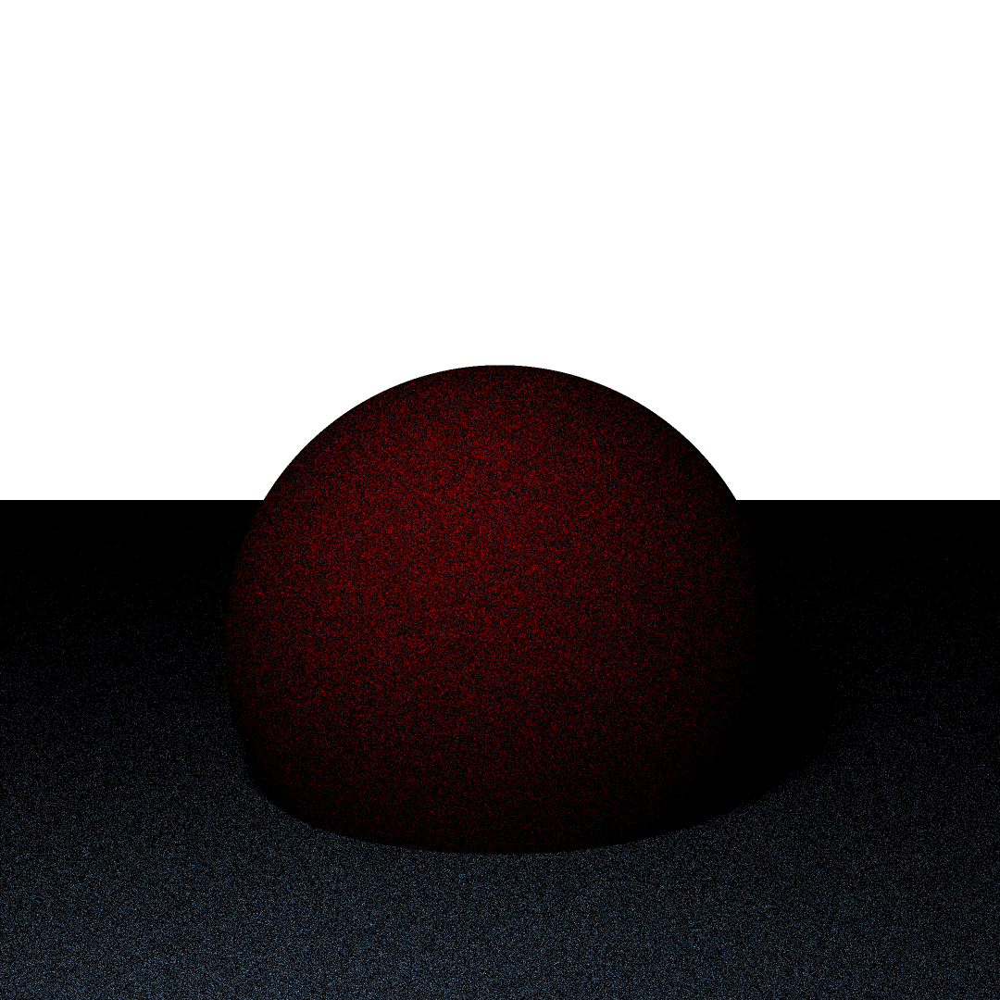

# Raytracer

A simple raytracer written in C++.

Phong illumination | Global illumination | Teapot mesh
--- | --- | ---
 |  | 

## Features

- Ray tracing with shadows and reflections
- Phong illumination model
- Global illumination using Monte Carlo path tracing
- Support for basic geometric primitives (spheres, planes)
- Mesh loading (OBJ format)
- Configurable camera and lighting

## Requirements

- C++11 or later
- CMake 3.10 or later
- A C++ compiler (GCC, Clang, MSVC)

## Building

1. make a build directory:
   ```bash
   mkdir build
   cd build
   ```

2. Run CMake to configure the project:
   ```bash
    cmake ..
    ```

3. Build the project:
   ```bash
   make
   ```

4. (Optional) Install the project:
   ```bash
    make install
    ```

## Usage

Run the raytracer with a scene description file:
```bash
./raytracer ../scenes/your_scene.txt
```

The output image will be saved as `output.png` in the current directory.